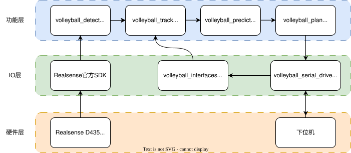
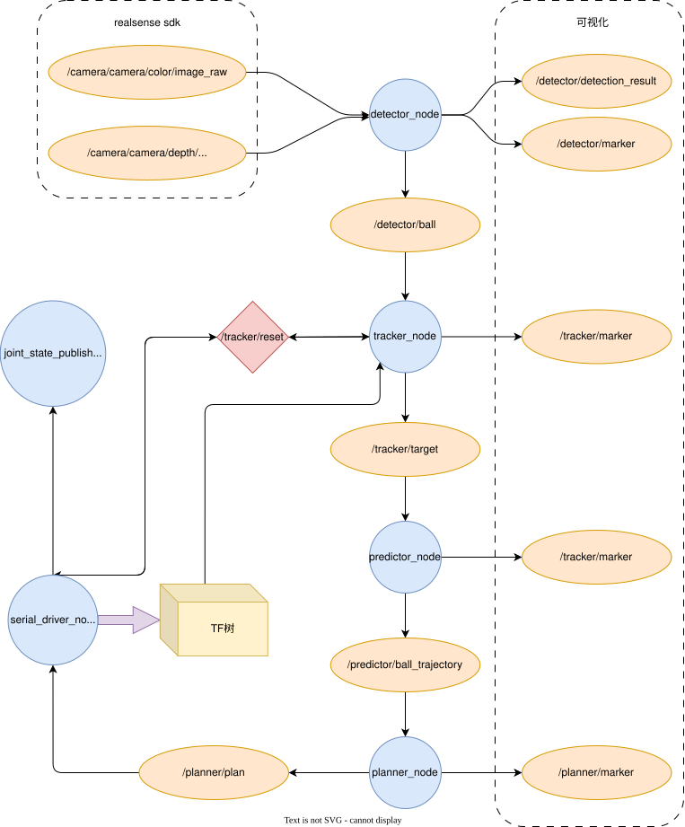
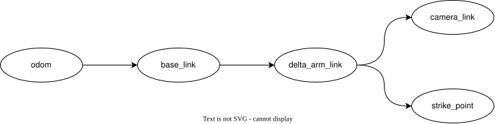

# VolleyballRobot
Robocon2026 排球机器人上位机算法方案1：落点预测

## 1.项目简介与效果

项目基于 ROS 2 Humble 开发的排球机器人上位机算法，实现排球检测、追踪、轨迹预测与接球规划的全流程功能。  

目前由于缺乏调试机会，效果功能并未真正实现，不稳定。效果体现在以下方面：
- 在笔者设备条件下，单帧处理时间为12ms上下，其余模块计算时间相较推理几乎忽略不计。
- realsense d435深度图定位精度2m内1%以内，且误差率随距离增大而增大，在7m达到5.6%几乎不可用，与官方推荐工作范围0.01-6m基本吻合；此外d435的FOV垂直视角只有42.5度，经常会出现球过高导致机器人无法识别到的情况；并且realsense d435彩色图像流最高60帧，且为卷帘快门，此帧率下只能达到848*480的画质，因此对于排球比赛并不够使用。
- 由于传感设备巨大误差且未经魔改的YOLO对于小目标识别准确率与召回率略低，因此KF在排球飞行前可能半段无法定位或者无法收敛导致无法准确估计落点使得机器人提前移动到目标落点接球，并且为确保安全下位机加了一个超出范围的规划点不执行移动，因此最终机器人呈现效果为大概率球飞行后半段下坠时才开始移动，经常球落地了才刚赶到落地位置，剩下情况为从未进入视野或因预测落点过于离谱根本没动。

*比较遗憾的是写开源的时候已经回家休息，当时并没有将调试日志记录从小电脑中拷贝出来，故此时无法准确体现出功能效果，只能定性描述效果。*

[调试寄录6月23日 视频](
https://github.com/user-attachments/assets/f28836a2-de18-4bcb-bcd5-a61a20ae5961)


(TODO:将调试日志找回并附在开源) 

---

## 2.架构


<center>图1 系统架构图</center>  

---


<center>图2 数据流图</center>

---


<center>图3 tf树</center>


## 3.ROS2包说明
| 包 | 输入 | 输出 | 功能 |
|------|------|------|------|
| **volleyball_detect** | RealSense RGB-D | `/detector/ball` | YOLOv11n + OpenVINO 检测排球 3D 位置 |
| **volleyball_interfaces** | --- | --- | ROS2自定义消息接口 |
| **volleyball_plan** | `/predictor/ball_trajectory` | `/planner/plan` | 计算接球位姿 |
| **volleyball_predict** | `/tracker/target` | `/predictor/ball_trajectory` | 预测球轨迹 |
| **volleyball_robot** | --- | --- | 总启动包，参数文件存放于此 |
| **volleyball_robot_description** | --- | --- | 排球机器人机械描述 |
| **volleyball_serial_driver** | `/planner/plan` | UART 下位机 | 串口协议通信，发布里程计 TF |
| **volleyball_track** | `/detector/ball` | `/tracker/target` | 线性阻力模型 EKF，输出平滑位置和速度 |

## 4.项目目录

drop_point_prediction  
├── docs    // 存放文档、图片  
│   └── ...  
├── src //ROS2源代码
│   ├── volleyball_detect   // 目标检测模块  
│   ├── volleyball_interfaces   //自定义接口  
│   ├── volleyball_plan     // 规划模块    
│   ├── volleyball_predict  // 预测模块  
│   ├── volleyball_robot    // 总启动包，包含参数文件  
│   ├── volleyball_robot_description    // 机器人描述  
│   ├── volleyball_serial_driver    //串口通信包  
│   └── volleyball_track    // 追踪、状态估计  
└── tools   //这里基本都是用AI生成的各种脚本，不一定好用  
    ├── ball_visualizer.py      //显示track包与观测数据对比图  
    ├── extract_img.py          //将ROSbag录包抽帧做数据集  
    ├── record_dataset.py       //直接录制并生成数据集  
    ├── reload.sh               //重新编译并启动一键命令  
    └── test_ball_publisher.py  //生成随机数据测试track、predict、plan包功能  

## 5.部署

### 本地部署

#### 本人使用项目环境
- 操作系统：Ubuntu 22.04
- ROS 2 Humble
- 相机：realsense d435
- 运算平台：minipc (CPU i5-12450)
- 通信方式：MicroUSB虚拟串口 type-c

#### 1. 拉取仓库
```bash
git clone https://github.com/XiaoFeiyu12/rc2026_volleyball.git
cd rc2026_volleyball/drop_point_prediction
```

#### 2. 安装系统依赖
```bash
sudo apt-get update && sudo apt-get install -y \
    wget gpg gnupg lsb-release ca-certificates tzdata \
    python3 python3-pip python3-yaml \
    libeigen3-dev \
    libopencv-dev \
    ros-humble-rclcpp \
    ros-humble-cv-bridge \
    ros-humble-vision-opencv \
    ros-humble-serial-driver \
    ros-humble-asio-cmake-module \
    ros-humble-std-msgs \
    ros-humble-sensor-msgs \
    ros-humble-geometry-msgs \
    ros-humble-visualization-msgs \
    ros-humble-message-filters \
    ros-humble-image-transport \
    ros-humble-rviz2 \
    ros-humble-xacro \
    ros-humble-robot-state-publisher \
    ros-humble-joint-state-publisher \
    ros-humble-tf2 \
    ros-humble-tf2-ros \
    ros-humble-tf2-geometry-msgs \
    ros-humble-std-srvs \
    ros-humble-foxglove-bridge
```

#### 3. 安装 RealSense SDK
```bash
sudo apt-get update && sudo apt-get install -y \
    ros-humble-librealsense2* \
    ros-humble-realsense2-*
```

#### 4. 安装 OpenVINO
具体安装查询[OpenVINO官方文档](https://www.intel.cn/content/www/cn/zh/developer/tools/openvino-toolkit/download.html?PACKAGE=OPENVINO_BASE&VERSION=v_2026_3_0&OP_SYSTEM=LINUX&DISTRIBUTION=PIP)

#### 5. 串口权限
串口设备（默认 `/dev/ttyACM0`）需要 `dialout` 组权限才能访问：
```bash
sudo usermod -a -G dialout $USER
```
> **注意：** 执行后需要**注销重新登录**（或重启）才能生效。可以用 `groups $USER` 确认是否已加入 `dialout` 组。

#### 6. 构建
```bash
source /opt/ros/humble/setup.sh
source /opt/intel/openvino/setupvars.sh
colcon build --parallel-workers 4
```

#### 7. 运行
```bash
source install/setup.bash
ros2 launch volleyball_robot bringup.launch.py
```

#### 8. 修改代码后重新编译
```bash
# 在工作区根目录执行
source /opt/intel/openvino/setupvars.sh
colcon build --parallel-workers 4
# 然后 Ctrl+C 停止当前 launch，重新运行即可
```

### 设置开机自启动
```bash
# 1. 创建 systemd 服务文件
sudo nano /etc/systemd/system/volleyball-robot.service
```
写入以下内容（将 `YOUR_USER` 替换为你的用户名，将 `/YOUR_PATH` 替换为实际路径）：
```
[Unit]
Description=Volleyball robot autostart (local)
After=network.target

[Service]
Type=simple
User=YOUR_USER
WorkingDirectory=/YOUR_PATH
ExecStart=/bin/bash -c "source /opt/ros/humble/setup.sh && source /opt/intel/openvino/setupvars.sh && source install/setup.bash && ros2 launch volleyball_robot bringup.launch.py"
Restart=on-failure
RestartSec=5

[Install]
WantedBy=multi-user.target
```
```bash
# 2. 重新加载 systemd 配置
sudo systemctl daemon-reload

# 3. 设置开机自启
sudo systemctl enable volleyball-robot.service

# 4. 立即启动测试
sudo systemctl start volleyball-robot.service

# 5. 查看状态（确认 active 且无报错）
sudo systemctl status volleyball-robot.service

# 关闭自启动
sudo systemctl disable volleyball-robot.service
```

## 6.原理
这里不会具体展开，只进行大致讲解，具体可以看各个功能包下的README文件。  
- detect 为上位机算法首环，将深度相机的RGB图像流与深度图像流同步，在RGB图像中找到排球2D图像坐标后，通过内外参得到排球2D坐标在深度图中的坐标，随后读取深度值估算出排球位置。[detect包介绍](src/volleyball_detect/README.md)  
- track 将detect得到的排球位置经过坐标系转换输入进KF，过程模型为**一次线型阻力加重力输入模型**，观测量为**位置**，状态为**排球位置、速度**，过程噪声**根据速度变化自适应**，观测噪声为**像素噪声+深度噪声**  [track包介绍](src/volleyball_track/README.md)  
- predict 将上一环节估计出的状态进行外推，直至排球高度接近地面，最后打包成轨迹发送给下游.[predict包介绍](src/volleyball_predict/README.md)  
- plan 根据轨迹和时间戳以及机器人击球安装位置判断应该移动至何处击打.[plan包介绍](src/volleyball_plan/README.md)  

## 7.待改进的地方
1. 相机选型上，是否可以优化为更好的深度相机或者自制的由工业相机组成的长基线双目模块，解决realsense d435工作范围不好覆盖赛场问题。
2. 视觉识别这里，对于YOLO模型是否可以进行一定修改，增加小目标检测头或者修改注意力机制，包括数据集制作上增加黄蓝白三色混杂的负样本，以及场地、灯光样本，因为在实际场地测试时发现易受场外例如广告牌、灯光影响，将其误识别为排球。
3. 测距定位手段上，是否有更好的测距方法，实际发现在深度图内会出现深度缺陷、深度计算不准确的问题，以及YOLO框出目标本身就有损失，如果换为单目测距方法会发现PnP由于排球球形缺乏角点退化预估不准与几何法一样误差过大。
4. 在状态估计与轨迹预测上，是否可以加入RNN/LSTM这类带有时间序列的神经网络，类似人类通过学习凭直觉判断球的位置以及未来的飞行轨迹、落点。也许能更好地解决球抛出画框外、漏检、数据波动导致无法预判的问题。
5. 在规划上，计算出的落点和规划击打点往往随时间不断修改，但未免有些跳跃，机器人底盘可能响应无法跟上，是否可以引入MPC控制优化规划指令。
6. 引入多线程处理。

## 8.后记
这个方案是我从去年12月份开始陆陆续续做的，毫无疑问，面对RC排球几乎0开源的情况下，想在第一年能够实现一套自动接球方案无疑是风险极大极其困难的甚至是不可能的，因为一个顶层算法的实现，需要保证底层硬件等基础设施的全面完善，可惜对于一个第一年打RC的队伍也是不太可能的。  
这套算法最早其实还包括机械臂的解算规划和仿真，不过后面发现接球时 delta 机械臂只需直上直下操作即可，并不像串联机械臂那般复杂。由于机械进度，这套方案实际测试只有短短不到两周，最终只能停止测试，转而寻求一种能够直接执行的低复杂度方案，也就是后面的 `ibvs` 视觉伺服控制方案。短短三天内从这套方案，历经纯图像 PID 方案，再到 IBVS 的快速迭代……   
不过赛场上还是见到了有队伍拿出完整的全自动方案，值得学习。今年对抗赛规则下，自动接球难度更高，多数队伍选择了手动，视觉算法在实战中被大幅简化。   
如果说今年用两个字形容我的代码，那无疑是遗憾了。我们队本身是打 RM，今年打不上超抗剩余人员被迫转向 RC。而明年之后战队重新奔赴超抗，这份代码的后续维护与传承也就此止步，索性开源吧。如果你们在 2027 年的 RC 上有看到福州大学，请记住那不是我们。  
再见，这份承载了我一年学习、知识、夜晚、泪水和遗憾的代码。

