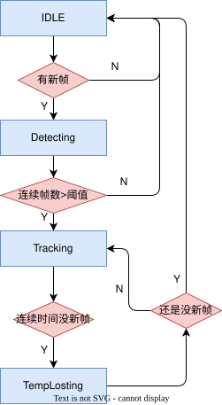

# volleyball_track

##
排球跟踪包，作为流水线的第二环。订阅检测结果，经 TF 变换到世界坐标系后输入扩展卡尔曼滤波器（EKF），输出平滑的排球位置与速度。包内提供观测模型、过程模型和卡尔曼滤波器内核解耦的头文件和工厂函数。最终只使用了**一次线形阻力模型**和**EKF~~不过已经退化为KF~~**对排球进行状态估计。

## ROS 接口

节点名：`tracker_node`

### Subscription

| 话题 | 消息类型 | 说明 |
|------|----------|------|
| `/camera/camera/color/camera_info` | `sensor_msgs/msg/CameraInfo` | 获取彩色相机焦距 `fx/fy`（用于测量噪声） |
| `/detector/ball` | `volleyball_interfaces/msg/Ball` | 排球检测结果（相机系 3D 位置） |

> 另通过 `tf2_ros::TransformListener` 监听 `/tf`、`/tf_static`，用于相机系→世界系坐标变换。

### Publisher

| 话题 | 消息类型 | 说明 |
|------|----------|------|
| `/tracker/target` | `volleyball_interfaces/msg/Ball` | 滤波后位置与速度（`x/y/z` + `vx/vy/vz`，世界系） |
| `/tracker/marker` | `visualization_msgs/msg/MarkerArray` | 位置/速度矢量/球体可视化 |

### Service

| 服务 | 消息类型 | 说明 |
|------|----------|------|
| `/tracker/reset` | `std_srvs/srv/Trigger` | 复位跟踪器至 `IDLE` |

### Parameter

| 参数 | 类型 | 默认值 | 说明 |
|------|------|--------|------|
| `k` | double | `0.20` | 空气阻力系数 |
| `m` | double | `0.27` | 排球质量（kg） |
| `g` | double | `9.80` | 重力加速度 |
| `Q_sigma_xy_min` | double | `10.0` | 过程噪声 xy 方向下限（低速） |
| `Q_sigma_xy_max` | double | `300.0` | 过程噪声 xy 方向上限（高速） |
| `Q_sigma_z_min` | double | `15.0` | 过程噪声 z 方向下限 |
| `Q_sigma_z_max` | double | `400.0` | 过程噪声 z 方向上限 |
| `sigma_pixel` | int | `2` | 像素噪声标准差 |
| `sigma_depth_gain` | double | `0.04` | 深度噪声随距离增益 |
| `sigma_depth_const` | double | `0.05` | 深度噪声常数项 |
| `detect_cnt_thres` | int | `3` | 检测确认次数阈值 |
| `lost_time_thres` | double | `0.5` | 丢检超时阈值（s） |
| `selfcheck_time_thres` | double | `0.05` | 丢检自检定时周期（s） |
| `target_frame_id` | string | `odom` | 世界坐标系名称 |

## 原理

### 坐标变换

这里需要说明一下，球得到的坐标为相机光心坐标系`camera_color_optical_frame`(x向右，y向下，z向前)

### 状态估计（EKF）

1. 状态量：$(p_x,v_x,p_y,v_y,p_z,v_z)^T$。
2. 状态方程：
  具体状态转移方程推导请见笔者的[推导笔记](../../docs/排球飞行轨迹预测_0_1786870938608.pdf)。这里给出结论：

$$ 
x_k|_k =(x,v_x,y,v_y,z,v_z)^T  
$$

$$
\beta = \frac{k}{m}    
$$

$$
M = \frac{1-e^{-\beta\Delta t}}{\beta} 
$$
$$ 
N =  e^{-\beta\Delta t}$$
$$    
x_{k+1}|_k =   
    \begin{pmatrix}
        1 &N &0 &0 &0 &0 \\
        0 &M &0 &0 &0 &0 \\
        0 &0 &1 &N &0 &0 \\
        0 &0 &0 &M &0 &0 \\
        0 &0 &0 &0 &1 &N \\
        0 &0 &0 &0 &0 &M
    \end{pmatrix} \cdot x_k|_k   
    + \begin{pmatrix}
        0 \\
        0 \\
        0 \\
        0 \\
        -\frac{g}{\beta}(\Delta-N)\\
        -gN
    \end{pmatrix} 
$$

1. 过程模型：一次线性阻力 + 重力,即以上空间状态转移方程加上过程噪声$Q$。
2. 测量模型：位置观测。  
$$

    (x,y,z)^T = \begin{pmatrix}
    1 &0 &0 &0 &0 &0\\
    0 &0 &1 &0 &0 &0\\
    0 &0 &0 &0 &1 &0\\
\end{pmatrix} \cdot (x,v_x,y,v_y,z,v_z)^T
$$
1. 过程噪声自适应。主要是测试时发现，如果只是白噪声模型的话会面临一个比较大的问题，即往往是在检测到球在人手上（对应球在对方机器人准备发球的过程）待比较久，然而抛出去只需要1-2秒就会着地，因此会出现如果Q设置太小，抛出去后卡尔曼滤波器无法跟随；如果Q设置太大无法起到滤波效果。于是参考RM那边自瞄的Q矩阵设计，将排球速度作为自变量引入，当速度v非常小时，也就是球并没发出去，此时认为噪声Q很大大到足以让球的加速度非常大瞬间飞出去，飞出去后进入飞行，贴近过程模型，此时Q变小至设置的最小量。公式如下：
$$
    \sigma_{白噪声}^2 = \begin{pmatrix}
        \frac{\Delta t^4}{4} &\frac{\Delta t^3}{2} \\
        \frac{\Delta t^3}{2} & \Delta t^2
    \end{pmatrix}
$$
$$
    k_{xy}  = (\sigma _{xymax}^2 - \sigma _{xymin}^2)e^{-v} + \sigma _{xymin}^2$$
$$
    k_{z}  = (\sigma _{zmax}^2 - \sigma _{zmin}^2)e^{-v} + \sigma _{zmin}^2$$  
$$
Q = \begin{pmatrix}
    k_{xy}\sigma_{白噪声}^2 &0 &0 \\
    0 &k_{xy}\sigma_{白噪声}^2 &0 \\
    0 &0 &k_{z}\sigma_{白噪声}^2 \\
\end{pmatrix} 
$$   
1. 测量噪声的设计同样参考RM自瞄的思路，分为相机偏离光轴投影带来的像素上的噪声和深度相机带来的深度噪声。那么在以$(x_c,y_c,z_c)^T$作为观测量的情况下，而噪声量为$(u,v,d)^T$(横向像素、纵向像素、深度)，这里需要做一次误差传播：  
输入误差
$$
    R_{in}=\begin{pmatrix}
        \sigma_u^2 &0 &0\\
        0 &\sigma_v^2 &0\\
        0 &0 &\sigma_d^2
    \end{pmatrix}\\   
$$
雅可比矩阵$J$为$(x_c,y_c,z_c)^T$对$(u,v,d)^T$的偏导，具体结果为
$$
J=\begin{pmatrix}
    \frac{z_c}{f_x} &0 &\frac{x_c}{z_c}\\
    0 &\frac{z_c}{f_y} &\frac{y_c}{z_c}\\
    0 &0 &1
\end{pmatrix}
$$
最后得到相机光心坐标系下误差：
$$
R_{cam}=JR_{in}J^T
$$
最后转换至排球场上里程计坐标系下：  
$$
R_{odom}=Rot \cdot R_{in}\cdot Rot^T
$$

其中$\sigma_u,\sigma_v$为水平竖直方向上的像素抖动误差，$\sigma_d$为相机深度误差，这个大家根据自己的相机确定跟深度的关系表达式即可
### 状态机

选择了比较经典的卡尔曼滤波器状态机。不过这个会带来一些延迟，以及帧数浪费，但可避免一些偶尔误检，建议阈值不要设太高。流程图如下：  

## 补充以及改进点
可惜了，感觉最大的问题在与调试次数以及没能分析出滤波后曲线不算太正常的原因，可能是上一环定位问题就很大还是这里卡尔曼滤波参数没对导致收敛失败，以及调参时缺乏测量手段，很难得知落点以及飞行轨迹中的情况与估计的情况是否一致。  
可能最大的问题在于如何定量科学地得知实际物理情况吧。

